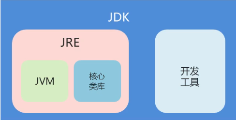
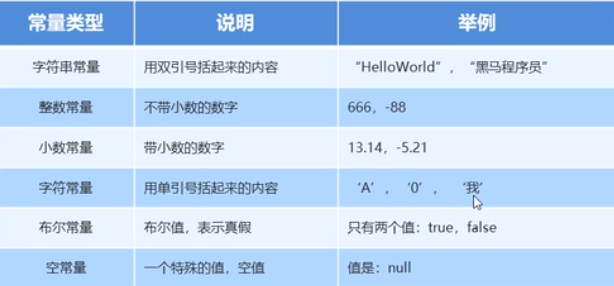

# Java学习过程

> Java是半编译型的语言，Java源码先被编译成字节码文件（中间文件），然后在有虚拟机（jvm）解释执行，这肯定比直接编译成二进制文件的运行速度慢一些

## 一、jre、jdk、jvm关系

- jdk：java development kid(java开发开源工具包)，针对java开发人员的产品，是整个java的核心，包括java运行环境jre、java工具和java基础类库。

- jre：java runtime environment(java运行环境),是运行java程序所必须的环境的集合，包含jvm标准实现以及java核心类库

- jvm：java virtual machine(java虚拟机)是整个java实现跨平台的最核心的部分，能够运行以java语言写作的软件程序。



## 二、环境配置

- [Java环境配置]([https://github.com/MrSayyes/Grocery-store/blob/master/%E7%8E%AF%E5%A2%83%E9%85%8D%E7%BD%AE/Java%E5%BC%80%E5%8F%91%E7%8E%AF%E5%A2%83%E9%85%8D%E7%BD%AE%EF%BC%88windows%E7%89%88%EF%BC%89.md](https://github.com/MrSayyes/Grocery-store/blob/master/环境配置/Java开发环境配置（windows版）.md))

## 三、第一个程序

输出hello World！（见JavaDemo工程的HelloWorld.java）

```java
package com.java.test;

public class HelloWorld {
	public static void main(String[] args) {
		System.out.println("Hello World！");
	}
}
```

## 四、Java介绍

#### 1、注释

单行注释：// 注释信息

多行注释：/* 注释信息 */

文档注释：/** 注释信息 */

```java
package com.java.test;

/**
 * 这是第一个程序
 * @author sayyes
 */
public class HelloWorld {
	//主程序类
	public static void main(String[] args) {
		/*
		 * 输出helloworld
		 */
		System.out.println("Hello World！");
	}
}

```

#### 2、关键字

如：public、class、static等

#### 3、常量

在程序不可变的值



#### 4、数据类型

##### 4.1 基本数据类型

- byte — 8位
- short — 16位
- int — 32位
- long — 64位
- float — 32位
- double — 64位
- char — 16位
- boolean — 8位

##### 4.2 引用数据类型

- 类
- 接口
- 数组

#### 5、变量

在程序运行中，值可以变量，变量存在内存中

如：int a=1;

- 静态变量：public static final double PI = 3.14;
- 成员变量：final int y = 10;
- 局部变量：public static void main(String[] args) {final double x = 3.3;}

#### 6、标识符

##### 6.1 定义

给类、方法、变量等起名的符号

##### 6.2 规则

- 由数字、字母、下划线和美元符组成
- 不能以数字开头
- 不能是关键字
- 区分大小写

##### 6.3 约定（驼峰命名[方法、变量]）

- 单词时首字母小写：name
- 多词时首字母小写，中间大写：lastName

注意：类是首字母大写

#### 7、类型转换

##### 7.1 自动转换（隐式转换）

类型兼容，由低级转高级，如double d=1;

##### 7.2 强制转换（显式转换）

由高级转低级，如int i = (int) 1.0;

### 五、运算符

- 一元运算符，如：-、++、--

- 二元运算符，如：+、-、*、/、%

- 算术运算符，如：+=、-=、*=、/=、%=

- 赋值运算符，如：=

- 逻辑运算符，如：&&、||、!、|、&

- 关系运算符，如：>、>=、<、<=、==、!=

- 自增/自减，如：i++、i--

- 位逻辑运算符，如：&、|、^、~

- 位移运算符，如：>>、<<

- 符合位赋值运算符，如：&=、|=、^=、-=、<<=、>>=

- 三目运算符，如：x>y ? x=1 : y=1

### 六、流程控制

**==案例见：IfOrSwitch.java==**

- if语句

```java
if (a > b) {
    System.out.println("a大于b");
}else {
    System.out.println("a小于b");
}
```

- switch语句

```java
switch (a) {
    case 1:
        System.out.println("输出1");
        break;
    case 2:
        System.out.println("输出2");
        break;
    default:
        System.out.println("默认输出");
}
```

- if与switch语句的区别
  - 使用效率：switch高于if
  - 实用性区分：if更实用

- 如何使用if和switch
  - 对于判断少的用if,判断多的用switch

### 七、循环

**==案例见：ForOrWhile.java==**

#### 1、for循环

```java
// for循环
for (int i = 1; i < 6; i++) {
    System.out.println("for循环：" + i);
}
```

#### 2、while循环

```java
// while
int w = 1;
while (w < 6) {
    System.out.println("while循环：" + w);
    w++;
}
```

#### 3、do...while循环

```java
// do...while
int dw = 1;
do {
    System.out.println("do...while循环：" + dw);
    dw++;
} while (dw < 6);
```

#### 4、for-each循环（增强for）

```java
// for-each(增强for)
int[] arr = { 1, 2, 3, 4, 5 };
for (int x : arr) {
    System.out.println("增强for：" + x);
}
```

#### 5、循环跳转与循环区别

- 区别：do...while不论是否满足条件都会执行一次
- 跳转：continue：跳过某次循环，执行下一次；break：跳出循环体

### 八、数组

**==案例见：ArrayDemo.java==**

#### 1、定义格式

- 格式1：数组类型[] 变量名；如：int[] arr

- 格式2：数据类型 变量名[]；如：int arr[]

#### 2、数组初始化

- 格式1：数据类型[] 变量名 = new 数据类型[数组长度]；如 int[] arr = new int[3];

- 格式2：数据类型[] 变量名 = new 数据类型[]{数据1，数据2，数据3}；如 int[] arr = new int[]{1,2,3};

  简化为int[] arr = {1,2,3}

#### 3、数组访问

- 格式：数组名[索引]；

#### 4、数组内存分配

如：int[] arr = new int[3];

- 栈内存：存储局部变量：int[] arr
- 堆内存：存储new出来的内容（实体、对象）：new int [3]

#### 5、数组常见操作

- 遍历

```java
int[] arr = {1,2,3,4,5};
//for遍历
for (int i = 0; i < arr.length; i++) {
    System.err.println("for遍历"+arr[i]);
}
```

- 数组最值获取

```java
//获取最小值
int[] array = {19,26,5,7,9,11};
int min = array[0];
for (int i = 0; i < array.length; i++) {
    if (min>array[i]) {
        min = array[i];
    }
}
System.out.println("最小值："+min);
```

- 数组转list

```java
// 数组转list
String[] strArr = {"1","2"};
List list = Arrays.asList(strArr);
System.out.println("list长度："+list.size());
```

- 数组转string

```java
//数组转String
String s = Arrays.toString(strArr);
System.out.println(s);
```

### 九、方法

**==案例见：MethodDemo.java==**

#### 1、定义格式：

```java
public static void 方法名() {
    //方法体
}
```

#### 2、案例

```java
package com.java.test;

public class MethodDemo {
	// 主函数
	public static void main(String[] args) {
		// 方法调用
		newMethod();
		newMethod("hello");
	}

	// 无参方法定义
	public static void newMethod() {
		System.out.println("无参方法！");
	}

	// 有参方法定义
	public static void newMethod(String s) {
		System.out.println("有参方法" + s);
	}
}

```

#### 3、形参和实参

- 形参：方法定义中的参数，如：public static void newMethod(String s) {}这里的s就是形参

- 实参：方法调用中的参数，如：newMethod("hello");这里的hello就是实参

#### 4、方法重载

指同一个类中定义的多个方法的关系，满足如下条件：

- 多个方法在同一个类中
- 多个方法具有相同的方法名
- 多个方法的参数不同，类型不同或数量不同

即：**同类同名不同参数列表**

#### 5、方法参数传递

- 值传递：变量不会因为方法里面变量操作而变化

- 引用传递：变量会因为方法的处理而变化

### 十、Debug调试

1、断点调试

- 加断点：断点位置代码前面双击
- 执行：使用debug执行
- 继续执行

```tex
F5单步调试进入函数内部。
F6单步调试不进入函数内部，如果装了金山词霸2006则要把“取词开关”的快捷键改成其他的。
F7由函数内部返回到调用处。
F8一直执行到下一个断点。
F11 这个好像是重新运行debug的，我也不确定，一直就当做重新运行debug的快捷键用的，呵呵。
```

### 十一、类和对象

#### 1、类的定义格式

```java
//声明类
public class Student {
    //成员变量
    String name;
    //成员函数
    public static void getName(String name) {
		System.out.println(name);
	}
}
```


